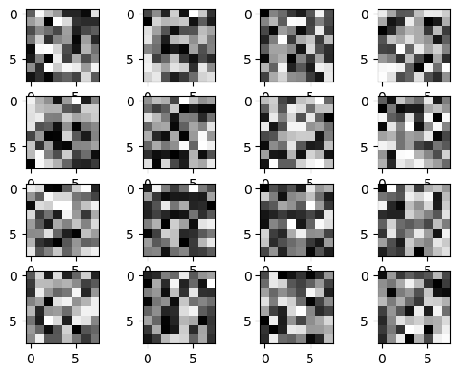
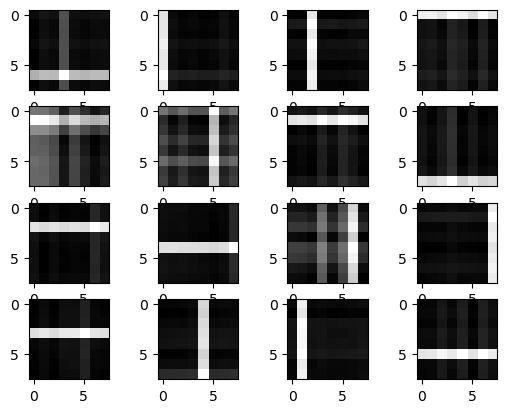
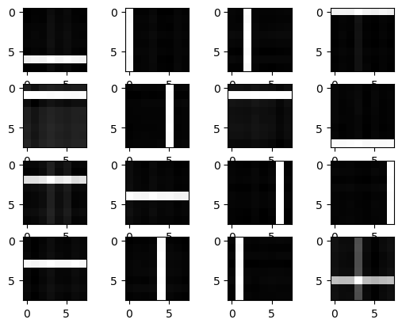

# Reproduction of "Forming sparse representations by local anti-Hebbian learning" by P. Földiak
Using Python & Numpy to reproduce this paper:
```
Földiák, P. Forming sparse representations by local anti-Hebbian learning. Biol. Cybern. 64, 165–170 (1990). https://doi.org/10.1007/BF02331346
```

See the Jupyter Notebook for details.

## Visualization
The feedforward weights of the 16 neurons visualized as a 8x8 grid of pixels.

Initial neurons:



Neurons after 600 trials:



Neurons after 1200 trials:




